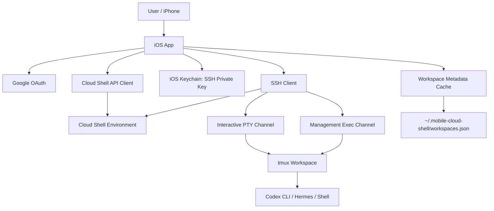
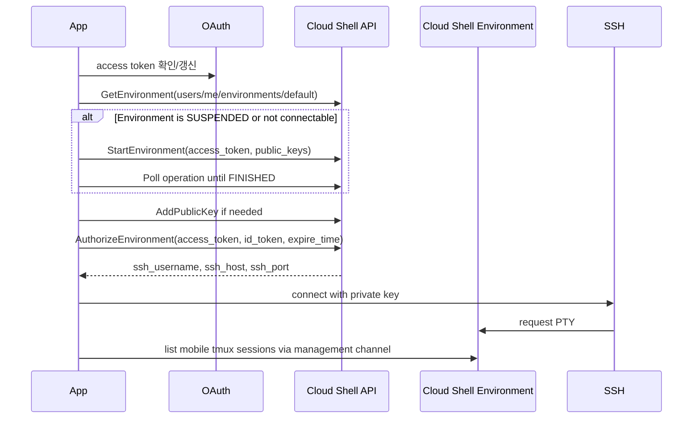
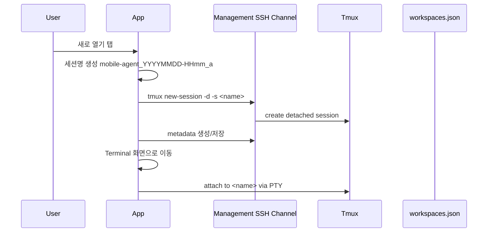
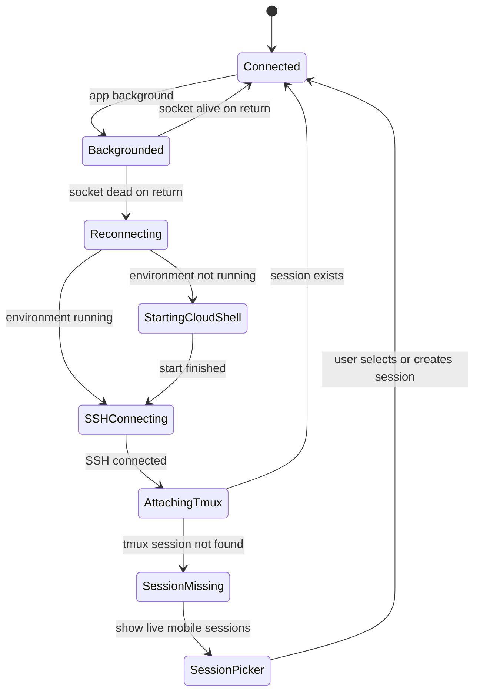

# Mobile Cloud Shell Terminal PRD v0.2

## 0. LLM용 초단기 요약

이 문서는 **iPhone 세로모드 전용 Google Cloud Shell 네이티브 SSH 터미널 앱**의 PRD다. 앱은 WebView나 Cloud Shell Editor를 만들지 않는다. 목표는 사용자가 iPhone에서 Codex CLI, Hermes 같은 터미널 기반 AI agent를 실행하고, 다른 앱을 보고 돌아와도 작업을 이어갈 수 있게 하는 것이다.

핵심 설계는 다음 네 가지다.

1. **Cloud Shell API + SSH 직접 접속**: Google Cloud Shell 환경을 시작하고 SSH 접속 정보를 받아 네이티브 터미널로 연결한다.
2. **tmux 기반 Workspace**: 각 작업은 `mobile-agent_YYYYMMDD-HHmm_{letter}` 형식의 tmux 세션에서 실행한다.
3. **앱 시작 시 세션 선택**: 앱은 자동으로 마지막 세션에 붙지 않는다. 살아있는 모바일 세션을 보여주고 사용자가 선택하게 한다. 없으면 “새로 열기”만 보여준다.
4. **모바일 터미널 입력 보조**: Ctrl/Shift 토글, Tab, Esc, 방향키, Home, End, Paste를 iPhone 세로모드에서 안정적으로 제공한다.

성공 기준은 “iOS 백그라운드에서 SSH 소켓이 절대 끊기지 않는 것”이 아니다. 성공 기준은 **Cloud Shell 안의 tmux/agent 작업이 유지되고, 앱 복귀 시 같은 Workspace로 자동 재접속할 수 있는 것**이다.

---

## 1. 제품 정의

### 1.1 제품명

임시 제품명: **Mobile Cloud Shell Terminal**

### 1.2 한 문장 설명

> iPhone에서 Google Cloud Shell에 SSH로 직접 접속하여 Codex/Hermes 같은 터미널 agent 작업을 tmux Workspace 단위로 안정적으로 실행·전환·복구하는 전용 터미널 앱.

### 1.3 대상 사용자

초기 대상 사용자는 **앱 소유자 1명**이다.

- Google 개인 계정 1개 사용
- iPhone 세로모드 중심
- Google Cloud Shell에서 Codex CLI, Hermes 등 AI agent 사용
- Safari Cloud Shell 웹 터미널의 입력 불편함과 수동 reconnect 문제를 해결하고 싶음

### 1.4 핵심 사용자 문제

현재 사용자는 두 가지 방식으로 Cloud Shell을 사용한다.

| 현재 방식 | 장점 | 문제 |
|---|---|---|
| 기존 앱 | Ctrl+C 같은 입력 가능 | 백그라운드로 가면 세션이 꺼지는 경험 |
| Safari 웹 터미널 | 세션이 잠시 살아있을 수 있음 | 복귀 시 “다시 연결” 버튼 필요, Ctrl/Tab/붙여넣기 불편 |

이 앱은 “웹 터미널을 조금 더 잘 감싸는 앱”이 아니라, **Cloud Shell VM에 직접 SSH로 붙는 네이티브 터미널 앱**이다.

---

## 2. 공식 문서 기반 전제 조건

이 문서의 기술 전제는 다음 공식 문서를 기준으로 한다.

| ID | 전제 | 근거 |
|---|---|---|
| R1 | Cloud Shell 사용자는 `default` environment를 갖고, API로 environment 정보를 조회·시작한 뒤 별도 SSH 클라이언트로 접속할 수 있다. | Google Cloud Shell API reference |
| R2 | Cloud Shell Environment는 `ssh_username`, `ssh_host`, `ssh_port`, `public_keys` 필드를 제공한다. | Google Cloud Shell API reference |
| R3 | `AddPublicKey`, `StartEnvironment`, `GetEnvironment`, `AuthorizeEnvironment`는 `cloud-platform` OAuth scope가 필요하다. | Google Cloud Shell API reference |
| R4 | Cloud Shell은 interactive use를 전제로 하며, 기본 주간 quota, session cap, inactive VM termination 같은 제한이 있다. | Google Cloud Shell quotas and limits |
| R5 | iOS 앱은 백그라운드에서 시스템에 의해 suspend될 수 있으므로 일반 SSH 연결을 무제한 유지하는 설계는 위험하다. | Apple background execution documentation |
| R6 | Codex CLI는 터미널에서 실행되는 interactive TUI이며 Ctrl+C, Ctrl+R, Tab, 방향키 같은 입력이 중요하다. | OpenAI Codex CLI documentation |

참조 URL은 문서 마지막의 **References** 섹션에 정리한다.

---

## 3. 목표와 비목표

### 3.1 MVP 목표

| 목표 ID | 목표 |
|---|---|
| G-01 | iPhone 세로모드에서 Google Cloud Shell에 네이티브 SSH 터미널로 접속한다. |
| G-02 | 앱 시작 시 살아있는 app-managed tmux Workspace 목록을 보여주고 선택하게 한다. |
| G-03 | Workspace가 없으면 “새로 열기” 버튼으로 새 tmux 세션을 만든다. |
| G-04 | Codex/Hermes 같은 터미널 agent를 tmux Workspace 안에서 실행할 수 있다. |
| G-05 | 앱 복귀 시 Cloud Shell 상태 확인, SSH 재접속, tmux attach를 자동화한다. |
| G-06 | Ctrl/Shift 토글, Tab, Esc, 방향키, Home, End, Paste 입력을 제공한다. |
| G-07 | 세션 전환·이름 변경·kill session을 UI에서 수행한다. |
| G-08 | 세션 kill은 y/n 확인을 거쳐 실수로 agent 작업이 죽지 않게 한다. |

### 3.2 비목표 / MVP 제외 범위

| 제외 ID | 제외 항목 | 이유 |
|---|---|---|
| NG-01 | Cloud Shell Editor | 사용자는 터미널만 필요하다고 확정함 |
| NG-02 | WebView 기반 Cloud Shell | 입력 UX와 reconnect 제어의 한계가 큼 |
| NG-03 | 다중 Google 계정 | 초기 앱은 개인 계정 1개 기준 |
| NG-04 | iPad 최적화 | iPhone 세로모드 우선 |
| NG-05 | Push 알림 | v1 이후 기능 |
| NG-06 | 기존 Cloud Shell 웹 tmux 세션 전체 선택 | v1 이후 기능 |
| NG-07 | Codex/Hermes 자동 실행 | 사용자가 직접 실행하기로 결정 |
| NG-08 | App Store 배포 최적화 | 초기 개인용 빌드 기준 |

---

## 4. 핵심 제품 원칙

1. **작업은 앱 안이 아니라 Cloud Shell tmux 안에서 살아야 한다.**  
   iOS 백그라운드 제약 때문에 앱 프로세스 생존을 핵심 성공 기준으로 삼지 않는다.

2. **터미널 입력은 웹보다 좋아야 한다.**  
   Ctrl/Shift 조합, Tab, 방향키, Home/End, Paste는 MVP 필수다.

3. **세션 전환 명령은 agent 입력으로 들어가면 안 된다.**  
   Codex/Hermes TUI가 실행 중일 때 `tmux switch-client` 같은 명령을 터미널 입력으로 주입하면 위험하다. 세션 관리 명령은 별도 management SSH channel에서 실행한다.

4. **Workspace display name과 tmux session name은 분리한다.**  
   tmux session name은 안정적인 식별자이고, 사용자가 보는 이름은 자유롭게 바꾸는 display name이다.

5. **앱 시작 시 사용자가 선택한다.**  
   살아있는 모바일 세션이 있으면 목록을 보여주고, 없으면 새로 열기 버튼을 보여준다. 자동으로 마지막 세션에 붙는 방식은 이번 버전에서 제외한다.

---

## 5. 전체 아키텍처



### 5.1 컴포넌트 설명

| 컴포넌트 | 책임 |
|---|---|
| Google OAuth | 개인 Google 계정 로그인, access token 획득/갱신 |
| Cloud Shell API Client | environment 조회, 시작, SSH public key 등록, gcloud credential 전달 |
| SSH Client | Cloud Shell VM에 SSH 접속, PTY 생성, exec command 실행 |
| Terminal Emulator | ANSI/VT sequence 렌더링, TUI 표시, scrollback |
| Keyboard Accessory Bar | Ctrl/Shift 토글, Tab, Esc, 방향키, Home, End, Paste |
| Session Manager | tmux Workspace 목록, 생성, attach, kill, display name 변경 |
| Reconnect Manager | 앱 복귀/네트워크 변경 후 SSH 재접속 및 세션 복구 |
| Workspace Metadata | tmux 세션명과 사용자가 보는 이름을 매핑 |

---

## 6. Cloud Shell 연동 스펙

### 6.1 OAuth

MVP는 Google 개인 계정 1개만 지원한다.

필수 scope:

```text
https://www.googleapis.com/auth/cloud-platform
```

### 6.2 Cloud Shell API 호출

필수 API:

| API | 사용 목적 |
|---|---|
| `GetEnvironment` | `users/me/environments/default` 상태와 SSH 접속 정보 조회 |
| `StartEnvironment` | Cloud Shell environment가 꺼져 있으면 시작 |
| `AddPublicKey` | 앱이 생성한 SSH public key를 Cloud Shell에 등록 |
| `AuthorizeEnvironment` | Cloud Shell 내부에서 gcloud 사용 시 수동 로그인 최소화 |

### 6.3 Cloud Shell 시작 플로우



### 6.4 SSH Key 정책

| 항목 | 정책 |
|---|---|
| 기본 key type | `ecdsa-sha2-nistp256` 권장 |
| private key 저장소 | iOS Keychain |
| public key 등록 | `AddPublicKey` |
| 중복 key | `ALREADY_EXISTS`는 성공으로 간주 가능 |
| key 재생성 | 설정 화면에서 수동 재생성 지원 가능 |
| 로그 정책 | private key, OAuth token, authorization header는 로그 금지 |

---

## 7. Workspace / tmux 세션 관리 스펙

### 7.1 용어 정의

| 용어 | 의미 |
|---|---|
| tmux session name | Cloud Shell 안에서 실제로 존재하는 tmux 세션명 |
| Workspace | 앱에서 사용자에게 보여주는 작업 단위 |
| display name | 사용자가 바꿀 수 있는 Workspace 이름 |
| app-managed session | `mobile-agent_` prefix를 가진 앱 관리 tmux 세션 |
| live mobile session | 현재 Cloud Shell VM에서 `tmux list-sessions`로 확인되는 app-managed session |

### 7.2 세션 이름 규칙

사용자 확정 요구사항:

```text
mobile-agent_YYYYMMDD-HHmm_{letter}
```

예시:

```text
mobile-agent_20260516-1530_a
mobile-agent_20260516-1530_b
mobile-agent_20260516-1612_a
mobile-agent_20260517-0920_a
```

#### 7.2.1 letter 규칙

| 항목 | 정책 |
|---|---|
| 문자 수 | 1글자 |
| 문자 집합 | `a-z`, 이후 필요 시 `A-Z` |
| 할당 순서 | `a`, `b`, `c`, ... `z`, `A`, `B`, ... `Z` |
| 충돌 처리 | 같은 `YYYYMMDD-HHmm` prefix에서 이미 존재하는 letter를 건너뜀 |
| 52개 소진 시 | 새 이름 직접 입력 또는 1분 뒤 생성 안내 |

> 주의: 사용자가 “하루에 20개 이상 세션을 켤 것 같지 않다”고 했지만, 이름에는 분 단위 시간이 포함되므로 실제 충돌은 같은 분에 여러 세션을 만들 때만 발생한다.

### 7.3 Workspace display name

사용자가 구분하기 쉽게 Workspace 이름을 바꿀 수 있어야 한다.

중요 정책:

- display name은 tmux session name과 별개다.
- display name 변경은 tmux session rename이 아니다.
- tmux session name은 stable ID로 유지한다.
- display name은 앱 시작 화면과 세션 내부 Sessions drawer 양쪽에서 수정 가능해야 한다.

예시:

| tmux session name | display name |
|---|---|
| `mobile-agent_20260516-1530_a` | `Codex: iOS PRD 정리` |
| `mobile-agent_20260516-1530_b` | `Hermes 실험` |
| `mobile-agent_20260516-1612_a` | `배포 스크립트 수정` |

### 7.4 Workspace metadata 저장

권장 저장 위치:

```text
~/.mobile-cloud-shell/workspaces.json
```

앱은 로컬에도 cache를 둘 수 있지만, Cloud Shell `$HOME`에 metadata를 저장하면 앱 재설치나 다른 기기에서도 display name을 복원할 수 있다.

예시 JSON:

```json
{
  "schemaVersion": 1,
  "workspaces": {
    "mobile-agent_20260516-1530_a": {
      "displayName": "Codex: iOS PRD 정리",
      "createdAt": "2026-05-16T06:30:00Z",
      "updatedAt": "2026-05-16T06:45:12Z",
      "lastOpenedAt": "2026-05-16T07:01:03Z"
    },
    "mobile-agent_20260516-1530_b": {
      "displayName": "Hermes 실험",
      "createdAt": "2026-05-16T06:31:20Z",
      "updatedAt": "2026-05-16T06:31:20Z",
      "lastOpenedAt": null
    }
  }
}
```

### 7.5 tmux 명령어

#### 세션 목록 조회

```bash
tmux list-sessions -F '#{session_name}|#{session_created}|#{session_activity}|#{session_windows}|#{session_attached}'
```

앱은 `mobile-agent_` prefix를 가진 세션만 MVP에서 보여준다.

#### 새 세션 생성

```bash
tmux new-session -d -s "mobile-agent_YYYYMMDD-HHmm_a"
```

#### 세션 attach

```bash
tmux attach-session -t "mobile-agent_YYYYMMDD-HHmm_a"
```

#### 세션 kill

```bash
tmux kill-session -t "mobile-agent_YYYYMMDD-HHmm_a"
```

#### 안전한 bootstrap 로직

```bash
SESSION_NAME="$1"

if command -v tmux >/dev/null 2>&1; then
  tmux has-session -t "$SESSION_NAME" 2>/dev/null || tmux new-session -d -s "$SESSION_NAME"

  if [ -n "$TMUX" ]; then
    tmux switch-client -t "$SESSION_NAME"
  else
    exec tmux attach-session -t "$SESSION_NAME"
  fi
else
  exec "${SHELL:-/bin/bash}" -l
fi
```

### 7.6 세션 관리 명령 실행 방식

세션 목록 조회, 이름 변경, kill, metadata 저장은 interactive terminal PTY에 문자열을 입력하는 방식으로 실행하면 안 된다.

권장 방식:

```text
Terminal PTY Channel: 사용자의 Codex/Hermes/shell 조작 전용
Management Exec Channel: tmux list/new/kill, metadata read/write 전용
```

이유:

- Codex/Hermes가 prompt 입력을 기다리는 중일 수 있음
- 세션 관리 명령이 agent prompt로 들어가면 작업이 오염될 수 있음
- 사용자가 보는 terminal buffer와 관리 명령 결과가 섞이면 UX가 나빠짐

---

## 8. 앱 시작 화면 스펙

### 8.1 시작 화면 원칙

앱 시작 시 자동으로 마지막 세션에 attach하지 않는다.

대신 다음 순서로 동작한다.

```text
앱 실행
→ Google 로그인 확인
→ Cloud Shell environment 시작/확인
→ SSH management connection 생성
→ live mobile sessions 조회
→ 세션 선택 화면 표시
```

### 8.2 살아있는 모바일 세션이 있는 경우

```
┌────────────────────────────────────┐
│ Mobile Cloud Shell                 │
│ Connected to Cloud Shell           │
├────────────────────────────────────┤
│ 살아있는 Workspace                 │
│                                    │
│ [ Codex: iOS PRD 정리       ✎ ]   │
│   mobile-agent_20260516-1530_a     │
│   activity: 2m ago · windows: 1    │
│                         [열기]     │
│                                    │
│ [ Hermes 실험               ✎ ]   │
│   mobile-agent_20260516-1530_b     │
│   activity: 12m ago · windows: 1   │
│                         [열기]     │
│                                    │
│ [+ 새로 열기]                      │
└────────────────────────────────────┘
```

필수 기능:

- 세션 열기
- display name 수정
- 새로 열기
- Cloud Shell 연결 상태 표시

### 8.3 살아있는 모바일 세션이 없는 경우

```
┌────────────────────────────────────┐
│ Mobile Cloud Shell                 │
│ Connected to Cloud Shell           │
├────────────────────────────────────┤
│ 살아있는 모바일 Workspace가 없습니다 │
│                                    │
│ Cloud Shell VM이 새로 시작되었거나   │
│ 이전 tmux 세션이 종료되었을 수 있음 │
│                                    │
│ [+ 새로 열기]                      │
└────────────────────────────────────┘
```

### 8.4 새로 열기 플로우



---

## 9. 터미널 화면 UI 스펙

### 9.1 기본 레이아웃

Sessions 버튼은 상단 작은 상태바 오른쪽에 둔다.

```
┌────────────────────────────────────┐
│ ● Connected · Codex: iOS PRD  [Sessions] │
├────────────────────────────────────┤
│                                    │
│           Terminal View            │
│                                    │
│  codex / hermes / shell / tmux      │
│                                    │
├────────────────────────────────────┤
│ Ctrl Shift Tab Esc  ← ↑ ↓ →        │
│ Home End Paste                     │
└────────────────────────────────────┘
```

상단 상태바 표시 후보:

| 상태 | 표시 |
|---|---|
| 정상 연결 | `● Connected · {displayName}` |
| 재접속 중 | `↻ Reconnecting · {displayName}` |
| Cloud Shell 시작 중 | `Cloud Shell starting...` |
| SSH 끊김 | `Disconnected · reconnecting...` |
| 세션 전환 중 | `Switching workspace...` |

### 9.2 Sessions drawer

Sessions drawer는 **위에서 아래로 내려오는 drawer**다. 아래에서 올라오는 bottom sheet가 아니다.

```
┌────────────────────────────────────┐
│ Sessions                           │
│                         [닫기]     │
├────────────────────────────────────┤
│ 현재: Codex: iOS PRD 정리          │
│ mobile-agent_20260516-1530_a       │
│ [이름 변경] [현재 세션 종료]       │
├────────────────────────────────────┤
│ 다른 살아있는 Workspace            │
│                                    │
│ Hermes 실험                  ✎     │
│ mobile-agent_20260516-1530_b       │
│ [전환] [종료]                      │
│                                    │
│ 배포 스크립트 수정           ✎     │
│ mobile-agent_20260516-1612_a       │
│ [전환] [종료]                      │
├────────────────────────────────────┤
│ [+ 새로 열기]                      │
└────────────────────────────────────┘
```

필수 기능:

- 현재 Workspace 표시
- 다른 Workspace로 전환
- 새 Workspace 생성
- Workspace display name 변경
- kill session
- drawer 닫기

### 9.3 세션 전환 UX

세션 전환은 현재 PTY에 명령을 주입하지 않는다.

```text
사용자: Sessions → 다른 Workspace [전환]
앱: 현재 PTY 연결 종료 또는 detach 처리
앱: 선택한 tmux session에 새 PTY attach
앱: Terminal View 교체
```

기존 세션은 kill하지 않으며, 그 안의 agent 작업은 계속 실행된다.

### 9.4 Kill session UX

사용자가 session 종료를 누르면 y/n 확인을 받는다.

```
┌────────────────────────────────────┐
│ Workspace를 종료할까요?            │
├────────────────────────────────────┤
│ Codex: iOS PRD 정리                │
│ mobile-agent_20260516-1530_a       │
│                                    │
│ 이 작업은 tmux session을 kill하며, │
│ 실행 중인 Codex/Hermes 작업도      │
│ 종료될 수 있습니다.                │
│                                    │
│ 종료할까요?                        │
│                                    │
│ [N: 취소]              [Y: 종료]   │
└────────────────────────────────────┘
```

정책:

| 상황 | 동작 |
|---|---|
| 현재 열려 있는 session kill | kill 후 start screen 또는 sessions drawer로 돌아가 남은 세션 선택 |
| 다른 session kill | 목록에서 제거, 현재 terminal은 유지 |
| kill 실패 | 에러 toast 표시 후 목록 refresh |
| 세션이 이미 없음 | metadata stale로 간주하고 목록 refresh |

### 9.5 Workspace 이름 변경 UX

이름 변경은 두 곳에서 가능해야 한다.

1. 앱 시작 시 세션 선택 화면
2. 터미널 내부 Sessions drawer

이름 변경 모달 예시:

```
┌────────────────────────────────────┐
│ Workspace 이름 변경                │
├────────────────────────────────────┤
│ 표시 이름                          │
│ [ Codex: iOS PRD 정리________ ]    │
│                                    │
│ tmux session                       │
│ mobile-agent_20260516-1530_a       │
│                                    │
│ [취소]                  [저장]     │
└────────────────────────────────────┘
```

제약:

- 빈 이름은 허용하지 않음
- 너무 긴 이름은 UI에서 말줄임 처리
- display name은 metadata에 저장
- tmux session name은 변경하지 않음

---

## 10. 모바일 키보드 입력 스펙

### 10.1 필수 보조 키

키보드 위 accessory bar에 다음 버튼을 제공한다.

```text
Ctrl  Shift  Tab  Esc  ←  ↑  ↓  →  Home  End  Paste
```

### 10.2 Ctrl 동작

| 사용자 행동 | 동작 |
|---|---|
| Ctrl 짧게 탭 | 다음 입력 1회에만 Ctrl 적용 |
| Ctrl 길게 누름 | Ctrl lock ON/OFF |
| Ctrl ON + `c` | `Ctrl+C` 전송 |
| Ctrl ON + `d` | `Ctrl+D` 전송 |
| Ctrl ON + `r` | `Ctrl+R` 전송 |
| Ctrl ON + `l` | `Ctrl+L` 전송 |

### 10.3 Shift 동작

| 사용자 행동 | 동작 |
|---|---|
| Shift 짧게 탭 | 다음 입력 1회에만 Shift 적용 |
| Shift 길게 누름 | Shift lock ON/OFF |
| Shift ON + Tab | `Shift+Tab` 전송 |
| Shift ON + ←/→ | `Shift+Left`, `Shift+Right` 전송 가능 |

일반 대문자 입력은 iOS 기본 키보드 Shift와 충돌하지 않도록 설계한다.

### 10.4 Paste 동작

| 항목 | 정책 |
|---|---|
| Paste 버튼 | 클립보드 내용을 terminal에 전송 |
| 길게 누르기 붙여넣기 | 가능하면 지원 |
| bracketed paste | 지원 권장 |
| 대량 붙여넣기 | chunking 또는 flow control 적용 |

### 10.5 TUI 입력 호환성

Codex CLI/Hermes 같은 TUI agent를 고려하여 다음 입력은 반드시 테스트한다.

- Ctrl+C
- Ctrl+D
- Ctrl+R
- Ctrl+L
- Tab
- Shift+Tab
- Esc
- 방향키
- Home/End
- Paste with multiline prompt

---

## 11. 백그라운드 / 재접속 스펙

### 11.1 핵심 전략

iOS 백그라운드에서 SSH 연결이 항상 유지된다는 보장은 하지 않는다.

대신 다음을 보장 목표로 삼는다.

```text
앱이 background/suspend/network change로 SSH 연결을 잃어도,
Cloud Shell 안의 tmux Workspace가 살아있다면,
앱 복귀 시 같은 Workspace에 자동 재접속할 수 있어야 한다.
```

### 11.2 앱 lifecycle 처리

| 이벤트 | 동작 |
|---|---|
| 앱 background 진입 | 현재 workspace ID, terminal size, reconnect state 저장 |
| 짧은 background | SSH 연결 유지 시도 가능 |
| suspend 또는 네트워크 변경 | SSH 끊김 허용 |
| foreground 복귀 | SSH 상태 확인 후 필요 시 재접속 |
| 재접속 성공 | 같은 tmux session에 attach |
| session 없음 | start screen으로 이동하여 live sessions 재조회 |

### 11.3 재접속 플로우



### 11.4 10분 목표 해석

사용자가 원하는 목표는 “다른 앱을 최소 10분 보고 와도 LLM agent 작업이 이어지는 것”이다.

이 목표는 다음 방식으로 달성한다.

| 항목 | 전략 |
|---|---|
| 앱의 SSH 소켓 | 유지 시도하되 보장하지 않음 |
| Cloud Shell 작업 | tmux session 안에서 실행 |
| 앱 복귀 | 자동 SSH 재접속 + tmux attach |
| 사용자 경험 | reconnect 버튼 없이 자동 복구 |

단, Cloud Shell 자체 quota, inactivity, session cap 등 외부 제약이 있으면 앱이 이를 완전히 우회할 수 없다.

---

## 12. 기능 요구사항

### 12.1 인증 / 계정

| ID | 요구사항 | 우선순위 |
|---|---|---|
| FR-AUTH-01 | Google 개인 계정으로 로그인할 수 있어야 한다. | P0 |
| FR-AUTH-02 | access token을 갱신할 수 있어야 한다. | P0 |
| FR-AUTH-03 | 로그아웃할 수 있어야 한다. | P1 |
| FR-AUTH-04 | OAuth token은 안전 저장하고 로그에 남기지 않는다. | P0 |

### 12.2 Cloud Shell 환경

| ID | 요구사항 | 우선순위 |
|---|---|---|
| FR-CLOUD-01 | `users/me/environments/default`를 조회한다. | P0 |
| FR-CLOUD-02 | environment가 꺼져 있으면 시작한다. | P0 |
| FR-CLOUD-03 | environment start operation을 polling한다. | P0 |
| FR-CLOUD-04 | SSH 접속 정보 `ssh_username`, `ssh_host`, `ssh_port`를 사용한다. | P0 |
| FR-CLOUD-05 | Cloud Shell quota/error 상태를 사용자에게 보여준다. | P1 |

### 12.3 SSH

| ID | 요구사항 | 우선순위 |
|---|---|---|
| FR-SSH-01 | 앱 최초 실행 시 SSH key pair를 생성한다. | P0 |
| FR-SSH-02 | private key는 Keychain에 저장한다. | P0 |
| FR-SSH-03 | public key는 Cloud Shell에 등록한다. | P0 |
| FR-SSH-04 | interactive PTY channel을 생성한다. | P0 |
| FR-SSH-05 | management exec channel을 생성한다. | P0 |
| FR-SSH-06 | 화면 크기 변경 시 PTY window size를 갱신한다. | P0 |

### 12.4 Workspace / Session

| ID | 요구사항 | 우선순위 |
|---|---|---|
| FR-WS-01 | app-managed tmux session 목록을 조회한다. | P0 |
| FR-WS-02 | 앱 시작 시 live mobile sessions 선택 UI를 보여준다. | P0 |
| FR-WS-03 | live session이 없으면 empty state와 새로 열기 버튼을 보여준다. | P0 |
| FR-WS-04 | 새 session명은 `mobile-agent_YYYYMMDD-HHmm_{letter}` 형식으로 만든다. | P0 |
| FR-WS-05 | 사용자가 Workspace display name을 변경할 수 있다. | P0 |
| FR-WS-06 | 이름 변경은 앱 시작 화면과 Sessions drawer 양쪽에서 가능하다. | P0 |
| FR-WS-07 | 세션 전환 시 기존 session은 kill하지 않는다. | P0 |
| FR-WS-08 | kill session 기능을 제공한다. | P0 |
| FR-WS-09 | kill 전 y/n 확인을 받는다. | P0 |

### 12.5 Terminal UI

| ID | 요구사항 | 우선순위 |
|---|---|---|
| FR-TERM-01 | ANSI terminal rendering을 지원한다. | P0 |
| FR-TERM-02 | Codex/Hermes TUI를 표시할 수 있어야 한다. | P0 |
| FR-TERM-03 | 터미널 scrollback을 지원한다. | P1 |
| FR-TERM-04 | iPhone 세로모드에서 글자 크기를 조절할 수 있다. | P1 |
| FR-TERM-05 | 상단 상태바에 연결 상태와 Workspace 이름을 표시한다. | P0 |
| FR-TERM-06 | Sessions 버튼은 상단 상태바 오른쪽에 둔다. | P0 |

### 12.6 키보드

| ID | 요구사항 | 우선순위 |
|---|---|---|
| FR-KEY-01 | Ctrl 짧게 탭은 다음 입력 1회에만 적용한다. | P0 |
| FR-KEY-02 | Ctrl 길게 누름은 lock ON/OFF다. | P0 |
| FR-KEY-03 | Shift 짧게 탭은 다음 입력 1회에만 적용한다. | P0 |
| FR-KEY-04 | Shift 길게 누름은 lock ON/OFF다. | P0 |
| FR-KEY-05 | Tab, Esc, 방향키, Home, End 버튼을 제공한다. | P0 |
| FR-KEY-06 | Paste 버튼을 제공한다. | P0 |
| FR-KEY-07 | multiline paste를 안정적으로 처리한다. | P1 |

### 12.7 재접속

| ID | 요구사항 | 우선순위 |
|---|---|---|
| FR-REC-01 | foreground 복귀 시 SSH 연결 상태를 확인한다. | P0 |
| FR-REC-02 | SSH가 끊겼으면 Cloud Shell environment 상태를 확인한다. | P0 |
| FR-REC-03 | environment가 꺼져 있으면 시작한다. | P0 |
| FR-REC-04 | 원래 열려 있던 Workspace가 살아 있으면 자동 attach한다. | P0 |
| FR-REC-05 | 원래 Workspace가 없으면 session picker로 이동한다. | P0 |
| FR-REC-06 | 사용자에게 수동 reconnect 버튼을 요구하지 않는다. | P0 |

---

## 13. 비기능 요구사항

| ID | 요구사항 | 설명 |
|---|---|---|
| NFR-01 | 안정성 | 네트워크 전환, 앱 background/foreground, SSH 끊김에 견뎌야 한다. |
| NFR-02 | 보안 | token/private key는 안전 저장하고 로그 금지. |
| NFR-03 | 반응성 | 터미널 출력이 많아도 UI가 멈추면 안 된다. |
| NFR-04 | 접근성 | 작은 화면에서 버튼이 너무 작지 않아야 한다. |
| NFR-05 | 복구성 | Cloud Shell quota, env unavailable, key failure를 사용자에게 설명해야 한다. |
| NFR-06 | 단순성 | MVP는 Cloud Shell Terminal에만 집중한다. |

---

## 14. 화면 목록

| 화면 | 설명 | MVP |
|---|---|---|
| Login Screen | Google 로그인 | Yes |
| Cloud Shell Starting Screen | environment 준비 상태 표시 | Yes |
| Session Picker | live mobile sessions 선택 | Yes |
| Empty Session State | session 없음 + 새로 열기 | Yes |
| Terminal Screen | SSH terminal | Yes |
| Top-down Sessions Drawer | 세션 전환/생성/이름변경/kill | Yes |
| Rename Workspace Modal | display name 수정 | Yes |
| Kill Confirmation Modal | y/n 확인 | Yes |
| Settings Screen | 로그아웃, key 재생성, 글자 크기 | Partial |

---

## 15. 사용자 플로우

### 15.1 최초 실행

```text
앱 실행
→ Google 로그인
→ SSH key 생성
→ Cloud Shell API로 public key 등록
→ Cloud Shell environment 시작
→ management SSH 연결
→ live mobile sessions 조회
→ 없으면 empty state 표시
→ 사용자가 새로 열기
→ 새 tmux Workspace 생성
→ terminal attach
```

### 15.2 일반 실행: 세션 있음

```text
앱 실행
→ Google token 확인
→ Cloud Shell 상태 확인
→ management SSH 연결
→ mobile-agent_* 세션 조회
→ Session Picker 표시
→ 사용자가 Workspace 선택
→ interactive PTY attach
```

### 15.3 Workspace 이름 변경

```text
사용자: 시작 화면 또는 Sessions drawer에서 ✎ 선택
→ Rename modal 표시
→ display name 입력
→ workspaces.json 업데이트
→ local cache 업데이트
→ UI 즉시 반영
```

### 15.4 Workspace kill

```text
사용자: Sessions drawer 또는 session row에서 종료 선택
→ y/n 확인 표시
→ N 선택: 취소
→ Y 선택: management channel로 tmux kill-session 실행
→ metadata는 stale/terminated로 처리하거나 삭제
→ session list refresh
```

### 15.5 앱 background 후 복귀

```text
사용자: Codex/Hermes 실행 중 다른 앱으로 이동
→ 앱은 현재 workspace ID 저장
→ iOS가 SSH 연결을 끊을 수 있음
→ 사용자가 앱 복귀
→ 앱이 SSH 상태 확인
→ 끊겼으면 재접속
→ 같은 tmux Workspace가 있으면 자동 attach
→ 없으면 Session Picker 표시
```

---

## 16. 에러 처리

| 에러 | 사용자 표시 | 내부 처리 |
|---|---|---|
| OAuth 만료 | Google 로그인이 필요합니다 | refresh 시도 후 실패 시 로그인 |
| Cloud Shell quota exceeded | Cloud Shell 사용량 한도에 도달했습니다 | API error details 표시 |
| Cloud Shell disabled | Cloud Shell이 계정에서 비활성화되어 있습니다 | 사용자 안내 |
| Environment unavailable | Cloud Shell 환경에 연결할 수 없습니다 | retry/backoff |
| SSH key rejected | SSH 키 인증에 실패했습니다 | public key 재등록 옵션 |
| tmux 없음 | tmux를 찾을 수 없습니다 | 일반 shell fallback 또는 설치 안내 |
| session missing | Workspace가 더 이상 존재하지 않습니다 | picker refresh |
| kill 실패 | 세션 종료에 실패했습니다 | refresh + 오류 표시 |
| metadata parse 실패 | Workspace 이름 정보를 읽지 못했습니다 | backup 생성 후 새 metadata |

---

## 17. 성공 기준 / Acceptance Criteria

### 17.1 제품 성공 기준

1. 사용자는 Safari를 열지 않고 Cloud Shell terminal을 사용할 수 있다.
2. 앱 시작 시 살아있는 모바일 Workspace를 선택할 수 있다.
3. Workspace가 없으면 새로 열기 버튼으로 새 세션을 만들 수 있다.
4. Codex/Hermes를 실행한 상태에서 다른 앱을 보고 돌아와도 같은 Workspace로 복귀할 수 있다.
5. Ctrl+C, Ctrl+R, Tab, 방향키, Home/End, Paste가 iPhone 세로모드에서 동작한다.
6. Workspace display name을 시작 화면과 terminal 내부에서 변경할 수 있다.
7. kill session은 y/n 확인 후 실행된다.
8. 수동 “다시 연결” 버튼 없이 자동 재접속이 시도된다.

### 17.2 테스트 시나리오

| ID | 테스트 | 기대 결과 |
|---|---|---|
| T-01 | 첫 실행 후 session 없음 | empty state + 새로 열기 표시 |
| T-02 | 새로 열기 | `mobile-agent_YYYYMMDD-HHmm_a` 생성 |
| T-03 | 같은 분에 새로 열기 반복 | `_a`, `_b`, `_c` 순서로 생성 |
| T-04 | 시작 화면에서 이름 변경 | display name 업데이트 |
| T-05 | terminal drawer에서 이름 변경 | display name 업데이트 |
| T-06 | 다른 Workspace 전환 | 기존 agent 작업 유지 |
| T-07 | 현재 Workspace kill 후 Y | 세션 종료 후 picker로 이동 |
| T-08 | kill에서 N 선택 | 아무 변화 없음 |
| T-09 | Ctrl 짧게 탭 + c | Ctrl+C 전송 |
| T-10 | Ctrl 길게 lock + r | Ctrl+R 전송 후 lock 유지 |
| T-11 | Shift + Tab | Shift+Tab 전송 |
| T-12 | multiline paste | 줄바꿈 포함 prompt 전송 |
| T-13 | 앱 background 10분 후 복귀 | session 살아있으면 자동 attach |
| T-14 | Cloud Shell VM 종료 후 복귀 | picker empty 또는 새로 열기 안내 |
| T-15 | Wi-Fi ↔ 5G 전환 | reconnect 후 attach |

---

## 18. MVP 이후 후보 기능

| 기능 | 설명 |
|---|---|
| 기존 Cloud Shell 웹 tmux 세션 선택 | 숫자형 기존 tmux 세션도 선택 가능하게 하기 |
| Push 알림 | agent 작업 완료 또는 승인 대기 감지 |
| 세션별 로그 스냅샷 | 마지막 화면/최근 출력 저장 |
| Workspace 태그 | Codex, Hermes, deploy 등 분류 |
| iPad 최적화 | split view, wider terminal |
| App Store 배포 | OAuth 검수, 개인정보처리방침, background mode 설명 |
| Cloud Workstations 지원 | Cloud Shell quota 제약이 문제가 될 때 대안 |

---

## 19. 설계상 중요한 결정 기록

| 결정 | 선택 | 이유 |
|---|---|---|
| 앱 방식 | Native SSH Terminal | WebView는 입력/reconnect 제어 한계가 큼 |
| Editor | 제외 | 사용자는 terminal만 필요 |
| 세션 유지 | tmux Workspace | iOS background SSH 생존을 보장하기 어려움 |
| 앱 시작 | session picker | 사용자가 여러 작업 중 선택하고 싶어함 |
| 세션명 | `mobile-agent_YYYYMMDD-HHmm_{letter}` | 날짜/시간 + 한 글자 suffix로 구분 가능 |
| suffix | 한 글자 alphabet | 하루 20개 이상 세션 가능성이 낮음 |
| 이름 변경 | display name 변경 | tmux session name은 stable ID로 유지 |
| kill session | MVP 포함 | 사용자가 여러 세션을 직접 관리해야 함 |
| kill 확인 | y/n | 실수로 agent 작업이 죽는 것 방지 |
| Sessions UI | top-down drawer | 사용자 요청 반영 |
| Sessions 버튼 | 상단 상태바 오른쪽 | 터미널 하단 키보드 영역 방해 최소화 |
| 자동 실행 명령 | 없음 | Codex/Hermes는 사용자가 직접 실행 |
| 알림 | v1 이후 | MVP 범위 축소 |

---

## 20. References

- [R1] Google Cloud Shell API reference: https://docs.cloud.google.com/shell/docs/reference/rpc/google.cloud.shell.v1
- [R2] Google Cloud Shell REST users.environments: https://docs.cloud.google.com/shell/docs/reference/rest/v1/users.environments
- [R3] Google Cloud Shell AddPublicKey: https://docs.cloud.google.com/shell/docs/reference/rest/v1/users.environments/addPublicKey
- [R4] Google Cloud Shell quotas and limits: https://docs.cloud.google.com/shell/docs/quotas-limits
- [R5] Apple Energy Efficiency Guide for iOS Apps — Work Less in the Background: https://developer.apple.com/library/archive/documentation/Performance/Conceptual/EnergyGuide-iOS/WorkLessInTheBackground.html
- [R6] OpenAI Codex CLI: https://developers.openai.com/codex/cli
- [R7] OpenAI Codex CLI features: https://developers.openai.com/codex/cli/features

---

## 21. 개발자에게 전달할 최종 요약

이 앱은 “Cloud Shell 웹사이트를 더 편하게 보여주는 앱”이 아니다. **Google Cloud Shell API로 environment를 시작하고, SSH로 직접 접속하는 iPhone 세로모드 터미널 앱**이다. 모든 장기 작업은 `tmux` Workspace 안에서 실행한다. 앱은 시작 시 살아있는 `mobile-agent_*` 세션을 보여주고 사용자가 선택하게 한다. 세션명은 `mobile-agent_YYYYMMDD-HHmm_{letter}`이며, 사용자가 보는 이름은 별도 display name으로 저장한다. Sessions 버튼은 터미널 상단 상태바 오른쪽에 있고, 위에서 내려오는 drawer로 세션 전환, 새로 열기, 이름 변경, kill을 수행한다. Ctrl/Shift는 짧게 누르면 다음 입력 1회 적용, 길게 누르면 lock이다. MVP의 핵심은 **Codex/Hermes TUI를 iPhone에서 안정적으로 조작하고, 앱 복귀 시 같은 tmux Workspace에 자동 재접속하는 것**이다.
